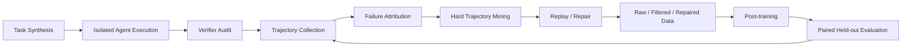

# Verifier-Guided Agentic Training for Terminal Agents

A compact public implementation of a verifier-guided data engine for terminal-agent post-training.

> **Research question:** can verifier-guided trajectory curation and repair produce more useful post-training data than raw execution traces under a matched supervision budget?



## Highlights

- **Verifier audit:** development probes + frozen held-out probes, so generated verifiers are tested instead of blindly trusted.
- **Hard trajectory mining:** prioritize verified model failures with protocol errors, repeated commands, or budget exhaustion; exclude infrastructure/API failures.
- **Replay-based repair:** only continue a failed trajectory if the original visible execution state can be reproduced.
- **Matched-budget data utility:** compare Raw / Filtered / Repaired training arms under the same assistant-action supervision budget and paired held-out evaluation.

## Layout

```text
src/agentic_training_lab/
  verifier_audit.py
  trajectory_mining.py
  trajectory_repair.py
  data_utility.py
tests/
examples/
docs/
```

## Quick start

```bash
cd projects/verifier-guided-agentic-training
python -m pip install -e .
python -m unittest discover -s tests -v
python examples/demo.py
```

## Data arms

| Arm | Definition |
|---|---|
| Raw | completed model trajectories, including verified failures |
| Filtered | independently verified successful trajectories |
| Repaired | filtered successes + successful continuations of reproducible failures |

## Evaluation

The final utility experiment should report held-out task success rate, paired delta vs. base, wins/losses, regressed tasks, per-category deltas, training-seed variation, uncertainty, and teacher/input cost.

See [docs/EXPERIMENTS.md](docs/EXPERIMENTS.md).

## Status

This public version exposes the core data/verification logic and experimental design. Large weights, private run artifacts, credentials, machine-specific deployment configuration, and internal server paths are intentionally excluded.

No model-quality improvement is claimed unless supported by a frozen held-out evaluation.

## Acknowledgements

Inspired by the terminal task-generation/post-training direction explored by **TMax** and the task/execution abstractions in **Harbor**. This project focuses on verifier reliability, trajectory repair, hard-example mining, and controlled data-utility evaluation.
